# Обзор артефактов кибератаки

Этот отчет представляет собой детальный анализ сетевого трафика и мониторинга безопасности с использованием инструментов, таких как Wireshark и Suricata. Данные были проанализированы для расследования потенциальных вредоносных активностей, включая троян Trickbot, эксплойт EternalBlue и DNS-туннелирование. 

---

## Результаты и анализ

### Анализ сетевых коммуникаций

#### Скриншот 1: HTTP GET-запрос на ZIP-файл (инструменты разработчика браузера)
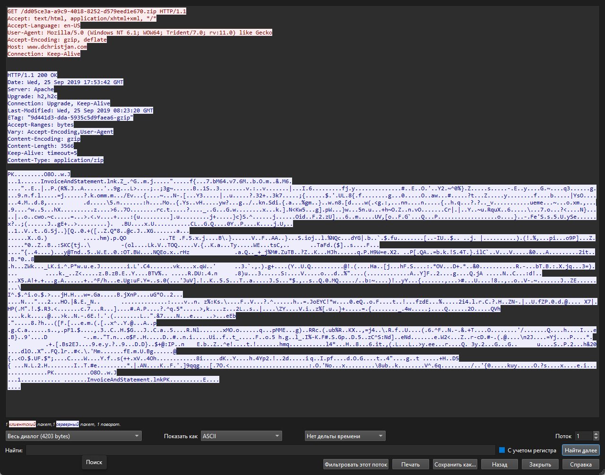
- **Описание**: Инструмент отслеживания потока HTTP Wireshark фиксирует HTTP GET-запрос на файл `DD05Ce3a-9c9-4818-8252-d579eedle676.zip`. Статус запроса — `200 OK`, размер файла — 3566 байт, сервер — Apache.
- **Анализ**: Успешная загрузка ZIP-файла с сайта `www.dchristjan.com` может указывать на начальный вектор доставки вредоносного ПО, такого как Trickbot. User-Agent (`Mozilla/5.0 (Windows NT 6.1)`) соответствует системам, часто являющимся мишенями атак.
- **Значимость**: Этот запрос может быть первым шагом в цепочке заражения.

#### Скриншот 2: Захват сетевого трафика в Wireshark (HTTP-запросы)
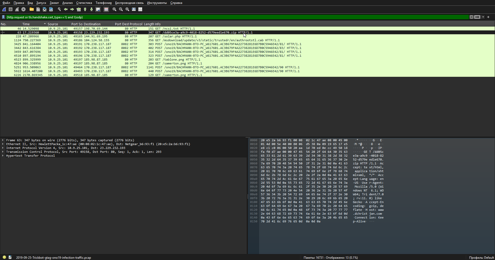
- **Описание**: Захваченный трафик показывает HTTP-запросы, включая `GET /download/update_3/studio/trusted/en/authorstool.cab` и `POST /Yon10/...`. 
- **Анализ**: Запросы к подозрительным URL и имя файла указывают на активность Trickbot, включая возможную коммуникацию с C2-сервером.
- **Значимость**: Подтверждает наличие вредоносного трафика в сети.

#### Скриншот 3: Захват пакетов в Wireshark (HTTP GET-запрос на solar.php)
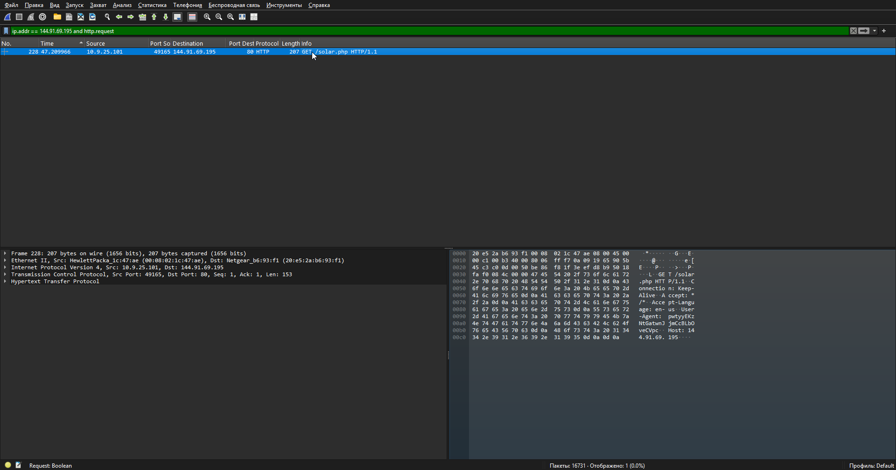
- **Описание**: Отфильтрованный вид (`ip.addr == 144.91.69.195 and http.request`) показывает запрос `GET /solar.php HTTP/1.1`.
- **Анализ**: Целевой запрос с конкретного IP может быть связан с доставкой вредоносного ПО.
- **Значимость**: Выделяет подозрительные точки взаимодействия в сети.

#### Скриншот 4: HTTP GET-запрос в Wireshark (загрузка исполняемого файла)
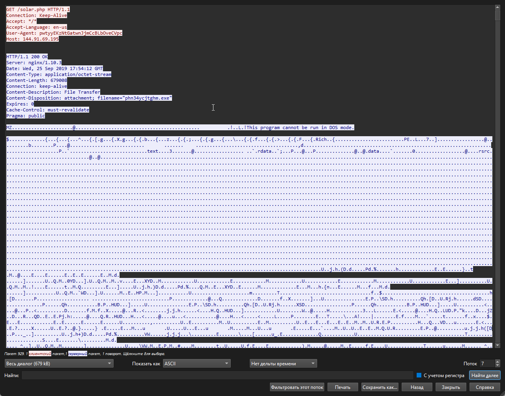
- **Описание**: Запрос `GET /solar.php` приводит к загрузке файла `phn3dycjthgm.exe` (739,608 байт) с кастомным User-Agent.
- **Анализ**: Загрузка EXE-файла с обфусцированным User-Agent — явный признак доставки вредоносного ПО, вероятно Trickbot.
- **Значимость**: Критическая находка, требующая немедленного реагирования.

#### Скриншот 5: Анализ TLS-рукопожатия в Wireshark
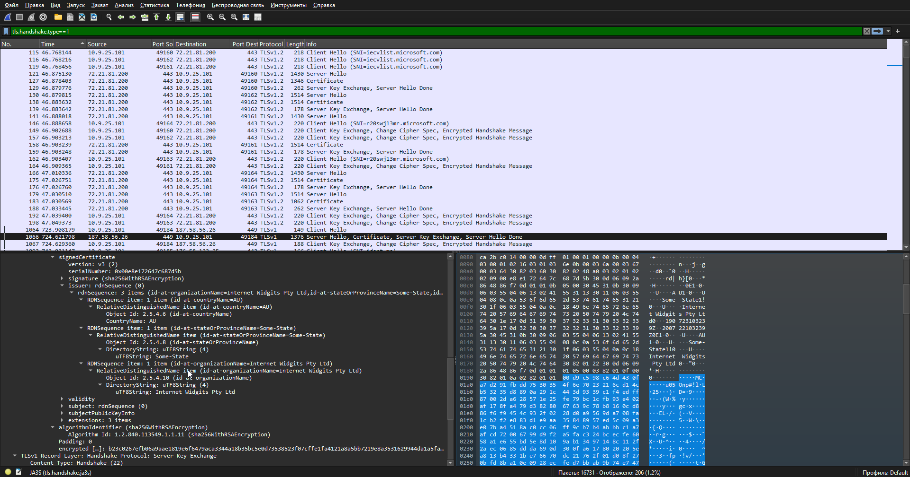
- **Описание**: Захват TLSv1-рукопожатия между `187.58.56.26` и `10.9.25.101`.
- **Анализ**: В контексте Trickbot вызывает подозрения.
- **Значимость**: Требует проверки на маскировку вредоносного ПО.

#### Скриншот 6: HTTP POST-запрос в Wireshark
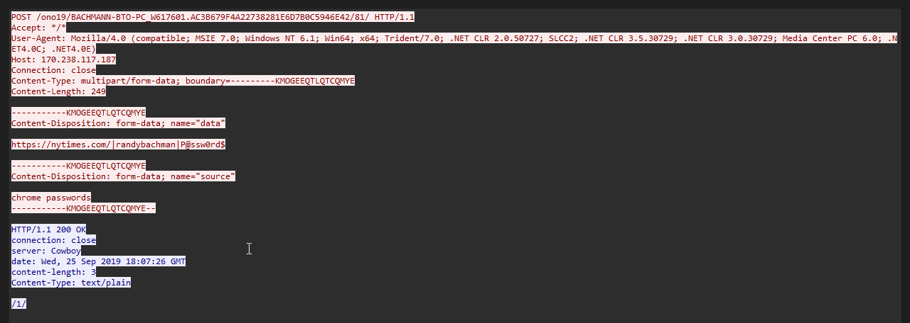
- **Описание**: POST-запрос к `nytimes.com/randybachman/p%s%words` с полем `chrome_passwords`.
- **Анализ**: Указывает на потенциальное хищение учетных данных, характерное для Trickbot.
- **Значимость**: Высокий риск утечки данных.

### Обнаружение угроз и предупреждения
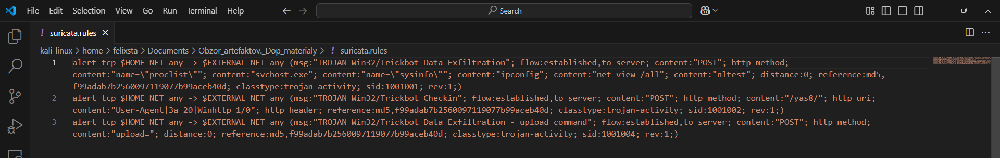
#### Скриншот 7: Правила Suricata в VS Code
- **Описание**: Файл `suricata.rules` содержит правила для обнаружения активностей Trickbot, таких как эксфильтрация данных и загрузки.
- **Анализ**: Правила настроены для эффективного мониторинга угроз.
- **Значимость**: Усиливает защиту сети.

### Скриншот 8: Анализ дампа трафика Trickbot с помощью Suricata
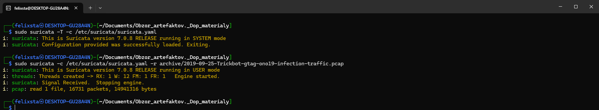
- **Описание**: Проверка корректности правил: `sudo suricata -T -c /etc/suricata/suricata.yaml`. Запуск анализа дампа: `sudo suricata -c /etc/suricata/suricata.yaml -r archive/2019-09-25-Trickbot-gtag-ono19-infection-traffic.pcap`.
- **Анализ**: Правила корректны, анализ дампа выполнен.
- **Значимость**: Усиливает защиту сети.

#### Скриншот 9: Fastlog в VS Code (предупреждения о Trickbot)
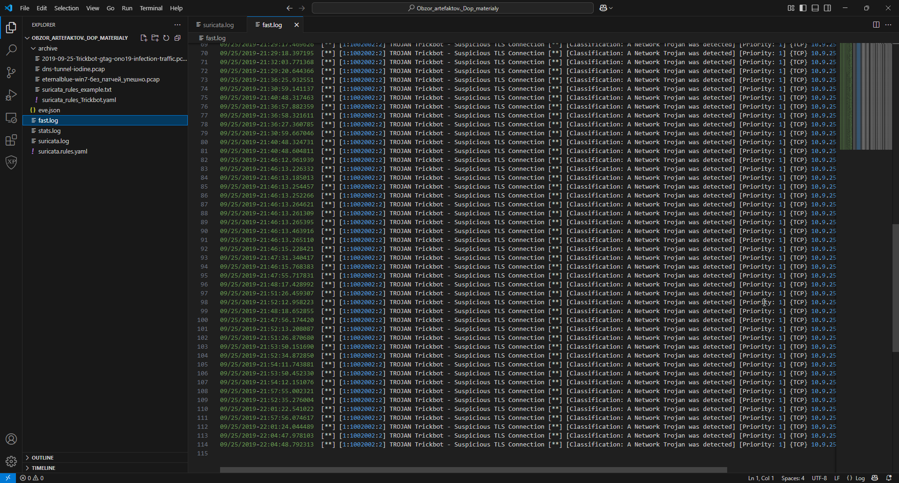
- **Описание**: Лог фиксирует более 115 предупреждений "TROJAN Trickbot - Suspicious TLS Connection".
- **Анализ**: Указывает на активность C2-сервера Trickbot.
- **Значимость**: Подтверждает наличие угрозы.

#### Скриншот 10: Анализ сработок правил (предупреждения о Trickbot)
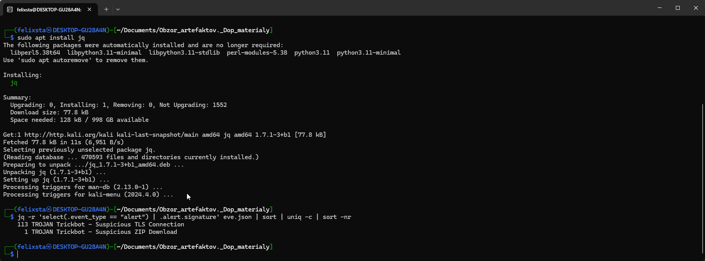

#### Скриншот 11: Анализ SMB-трафика в Wireshark
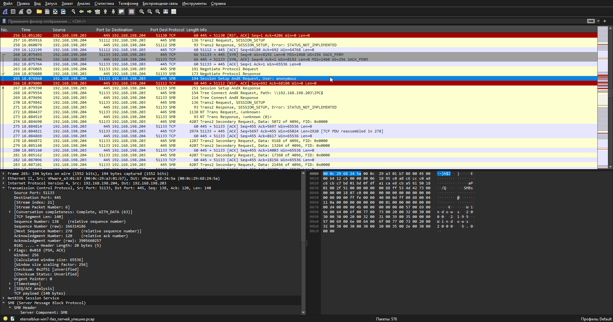
- **Описание**: Успешная настройка SMB-сессии (`Session Setup AndX Response`).
- **Анализ**: Может быть связано с эксплуатацией EternalBlue.
- **Значимость**: Указывает на уязвимость системы.

### Скриншот 12: Анализ дампа трафика EternalBlue с помощью Suricata
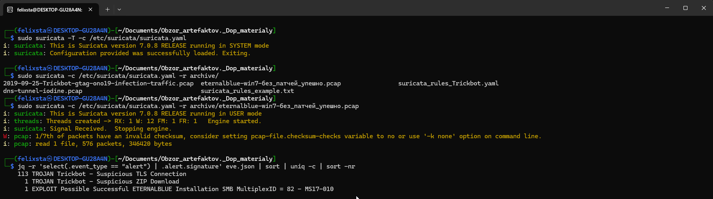
- **Описание**: Проверка корректности правил: `sudo suricata -T -c /etc/suricata/suricata.yaml`. Запуск анализа дампа: `sudo suricata -c /etc/suricata/suricata.yaml -r archive/eternalblue-win7-без_патчей_упешно.pcap`.
- **Анализ**: Правила корректны, анализ дампа выполнен.
- **Значимость**: Усиливает защиту сети.

#### Скриншот 13: Статистика DNS в Wireshark
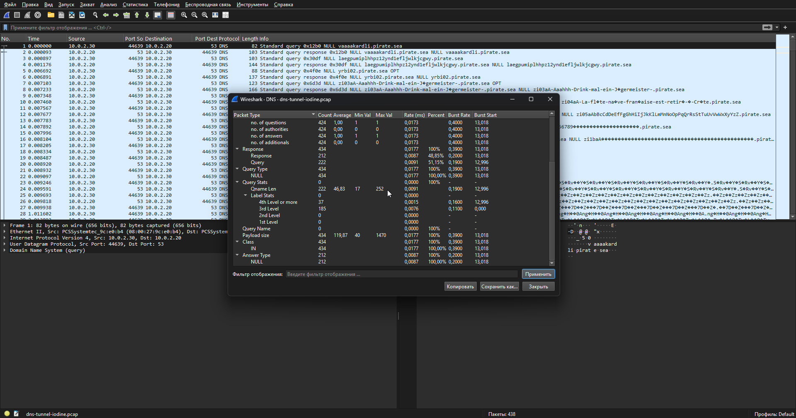
- **Описание**: Этот скриншот из Wireshark показывает DNS-трафик.
- **Список пакетов**: DNS-запросы к доменам .pirate.sea.
- **Статистика**: 424 запроса (48,85%), 424 ответа, из файла dns-tunnel-iodine.pcap.
- **Анализ**: Очевидно использование DNS-туннелирования, распространенной техники вредоносного ПО.

#### Скриншот 14: Анализ DNS-туннелирования в Suricata
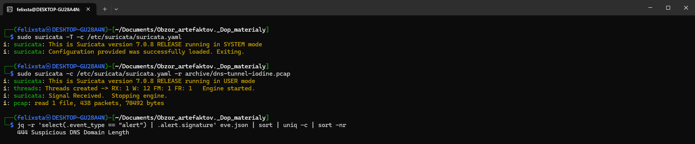
- **Описание**: Анализ PCAP-файла выявил 444 предупреждения "Suspicious DNS Domain Length".
- **Анализ**: Подтверждает DNS-туннелирование как метод эксфильтрации.
- **Значимость**: Серьезная угроза безопасности.

---

## Выводы

Анализ выявил сложный сценарий атаки, включающий следующие угрозы:
1. **Trickbot**: Доставка через ZIP- и EXE-файлы, подозрительные TLS- и HTTP-запросы, хищение данных.
2. **EternalBlue**: Успешные SMB-сессии указывают на возможную эксплуатацию.
3. **DNS-туннелирование**: Обнаружено как метод эксфильтрации данных.